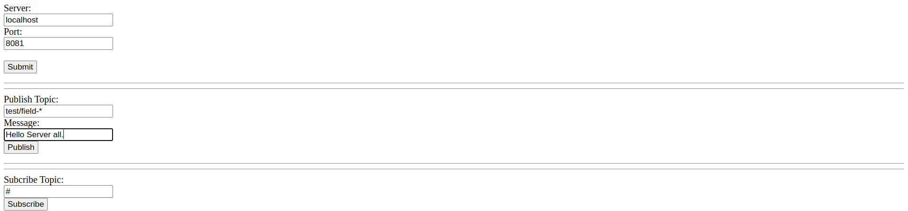

# mqtt-web
A minimal web interface for MQTT to test

# HTML Page

# CLI and Setup Mosquitto

## Install Mosquitto
`sudo apt-get install mosquitto mosquitto-clients -y`

## Configure Mosquitto

The Mosquitto configuration file is located at /etc/mosquitto/mosquitto.conf. You can edit this file using a text editor like nano:

`sudo nano /etc/mosquitto/mosquitto.conf`

## Start and Enable Mosquitto

`sudo systemctl start mosquitto`
`sudo systemctl enable mosquitto`
`sudo systemctl status mosquitto`

## Start the subscription

At this point, you should have a working MQTT broker. You can test it using Mosquitto’s built-in clients. On your server, subscribe to a test topic:

`mosquitto_sub -h localhost -t test`

### Publish
In a new terminal window, connect to your server again and publish a message to the test topic:
`mosquitto_pub -h localhost -t test -m "hello world"`

You should see “hello world” appear in the terminal where you ran mosquitto_sub.
